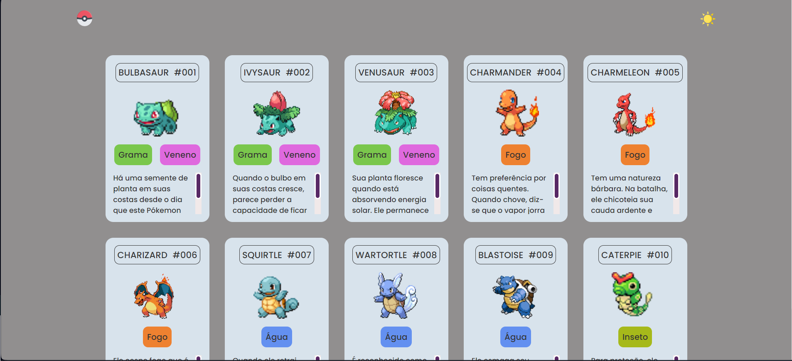

# Listagem de Pokémons 🔥🌱🌊

Este é um projeto de listagem de Pokémons desenvolvido utilizando HTML, CSS e JavaScript. Ele permite visualizar uma lista de Pokémons e obter informações detalhadas sobre cada um deles.

## Descrição

A Listagem de Pokémons é uma aplicação web que tem como objetivo fornecer informações sobre diferentes Pokémons, incluindo suas características, tipos, habilidades.

## Funcionalidades

- Mostrar uma lista de Pokémons com imagens e nomes.
- Permitir ao usuário clicar em um Pokémon para obter informações detalhadas sobre ele.
- Exibir detalhes do Pokémon selecionado, como tipo, habilidades.

## Como Usar

1. Abra o navegador web e acesse o seguinte link: https://github.com/guilherme-silvam/listagem-pokemon.git.
2. Na página inicial, você verá uma lista de Pokémons com suas respectivas imagens e nomes.
3. Clique em um Pokémon para visualizar informações detalhadas sobre ele, incluindo tipo, habilidades e estatísticas.

## Tecnologias Utilizadas

- HTML
- CSS
- JavaScript

## Contribuição

Contribuições são bem-vindas! Se você quiser contribuir para este projeto, siga estas etapas:

1. Fork o projeto.
2. Crie uma nova branch (`git checkout -b feature/nova-funcionalidade`).
3. Faça commit das suas alterações (`git commit -am 'Adicione uma nova funcionalidade'`).
4. Faça push para a branch (`git push origin feature/nova-funcionalidade`).
5. Abra um Pull Request.

## Visualização

Aqui está uma prévia de como o site aparece(Clique na imagem caso queira acessar o site)

## Contato

- E-mail: guisilvam19@gmail.com ou  guilhermemachado019@gmail.com
- Projeto Link: https://guilherme-silvam.github.io/listagem-pokemon/
